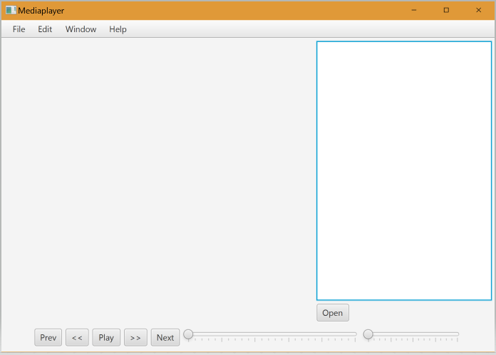
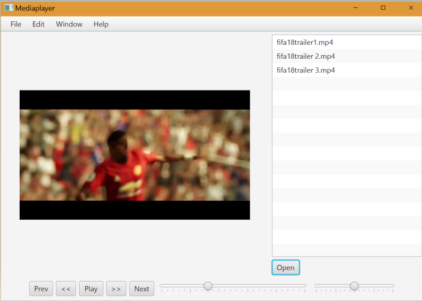
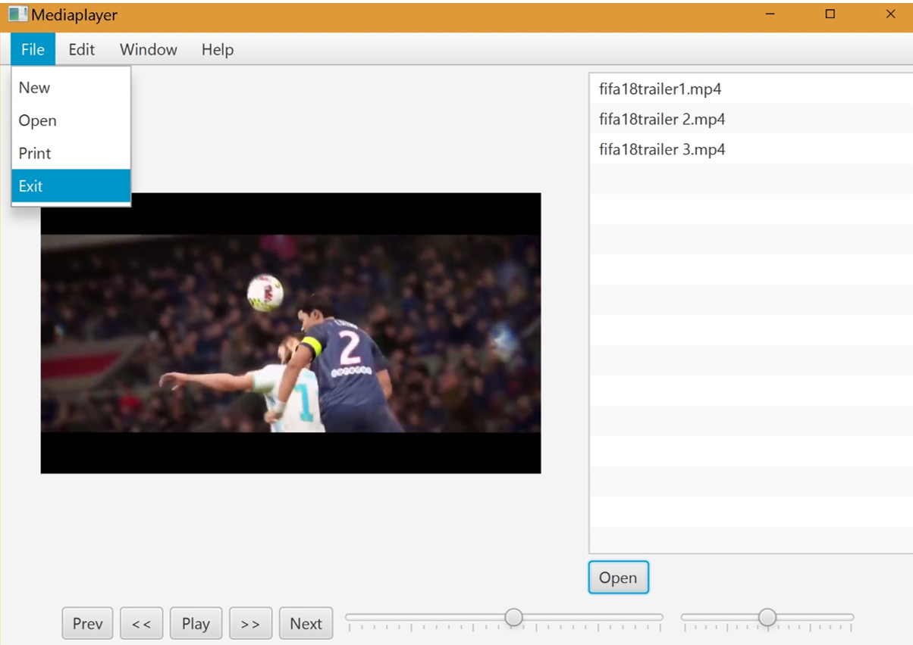

  ## Media Player

  * This application was build in JavaFx.
  * User can add as many media file they want by clicking on Open button and change the media by double clicking on a file or by clicking next button, previous button.
  * It has play/paus, volume, seek functionality as well as fast forward, rewind.
  * Program can be terminated from the Menu Open -> exit

  * After running the Program.

    

  * Playing a media file.

    

  * Exit the Program.

    
